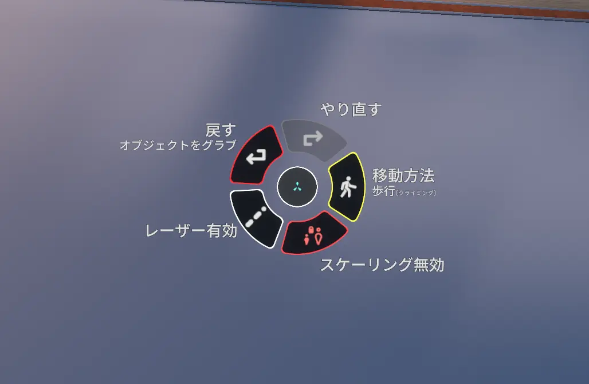

# コンテキストメニュー  
主に装備したツールやアバター、ワールドのギミックなどの操作に使われる丸いメニューです。**他の人からも見えます**。


*デフォルトのコンテキストメニュー。ワールドやアバターによって項目が増えたりします*

### 開き方
- **デスクトップモード:** Tキー
- **Viveコントローラー:** メニュー
- **Indexコントローラー:** Bボタン
- **Questコントローラー:** B,Yボタン
## 項目
コンテキストメニューにはデフォルトで5つの項目があります。  
### 戻す
何かをつかんだ、動かした、数値入力など、何かしらの動作を一つ巻き戻します。
### やり直す
「戻す」で巻き戻した動作をもとにもどします。
### 移動方法
移動方法を変更します。
### スケーリング有効/無効
「スケーリング有効」にすると、自分自身のサイズを変えることができます。
「スケールリセット」を押すことで、元の大きさに戻ることができます。
- **デスクトップモード:** Ctrl+マウスホイール回転
- **VRモード:** 空中を両手でグラブして、両手の距離を近づけたり遠ざけたりする

**小さくなりすぎないでください！元に戻れなくなります！**
### レーザー有効/無効
VRモードでのレーザー操作のオンオフを切り替えます。詳細は後述（[レーザーを操作する](laser.md)）
```
コンテキストメニューの項目は、ユーザーが追加することができます。上記以外の項目がある場合、アバターやワールドに付属する形で新たに設定されていると思われます。
```