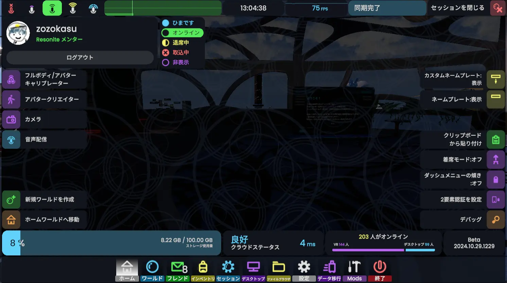

# ダッシュメニュー
アカウント情報やワールド、インベントリ、設定など、Resoniteのアプリ自体に関わる項目が取り扱われています。**他の人からは見えません**。 

### 開き方
- **デスクトップモード:** Escキー
- **Viveコントローラー:** メニュー長押し
- **Indexコントローラー:** Aボタン
- **Questコントローラー:** A,Xボタン

それぞれのタブについて簡単に触れておきます。

## ホーム
アカウント情報や、よく使う機能にアクセスできます。
## ワールド
ワールドやセッションを検索できます。
## フレンド
フレンドリストです。
## インベントリ
アイテムやアバターを保存することができる、サーバー上の自分のストレージです。
## セッション
今いるセッションに関する設定ができます。
## デスクトップ
VRモード向けの機能です。ここからデスクトップを操作できます。
## ファイルブラウザ
PC上のファイルをワールドに出すことができます。
## 設定
Resoniteの機能や動作をカスタマイズできます。
## データ移行
NeosVRからデータを引っ越しできます。
## 終了
Resoniteを終了する画面が表示されます。押した直後にResoniteが終了したりはしません。  
「ホームを保存して終了」のホームはホームワールド、Resoniteを起動したときに自動的に読み込まれる家のようなワールドのことです。