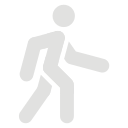
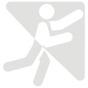
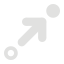

# 移動方法
Resoniteでは歩くだけでなく、空を飛ぶほか、酔いやすい人はテレポートといった移動方法を利用できます。  
移動方法は、コンテキストメニューから変更できます。

| アイコン | 移動方法       | 説明                     |
|-----|------------|------------------------|
 || 歩行（クライミング） | 歩く・壁を掴んで登ることができる移動方法です |
    || フライ            | 空を飛ぶことができる移動方法です       |
    || ノークリップ      | 壁や床を無視して移動できる移動方法です    |
    || テレポート        | 照準の先にテレポートできる移動方法です    |
## 歩行（クライミング）
歩く、ジャンプするなどの基本的な移動方法です。  
### 歩く
- **デスクトップモード:** WASDキー
- **Viveコントローラー:** 左コントローラーのパッド方向ボタンで移動、右コントローラーのパッド方向ボタン左右で回転
- **Indexコントローラー:** 左コントローラーのスティックで移動、右コントローラーのスティック左右で回転
- **Questコントローラー:** 左コントローラーのスティックで移動、右コントローラーのスティック左右で回転
### ジャンプ
- **デスクトップモード:** スペースキー
- **Viveコントローラー:** パッドの中心を押し込み
- **Indexコントローラー:** トラック押し込み
- **Questコントローラー:** スティック押し込み
```
利き手の設定をLeftに変更している場合、使用するスティックは左右逆のものになります。
```
### クライミング
主にVR用の機能ですが、「クライミング」の名の通り壁をよじのぼることができます。
- **VRモード:** 壁や地形など、当たり判定のあるものを直接グラブしてコントローラーを動かす
## フライ
空を飛ぶことができます。  
VRモードでは、デフォルトで頭の向きに移動します。設定で手の方向に移動するように変更できます。
- **デスクトップモード:** スペースキーで上昇、Ｃキーで下降
## ノークリップ
フライと良く似ていますが、壁（当たり判定）を無視して移動できるという大きな違いがあります。
## テレポート
VRモードのみの移動方法です。
スティックを倒した時に表示される照準の先にテレポートできます。