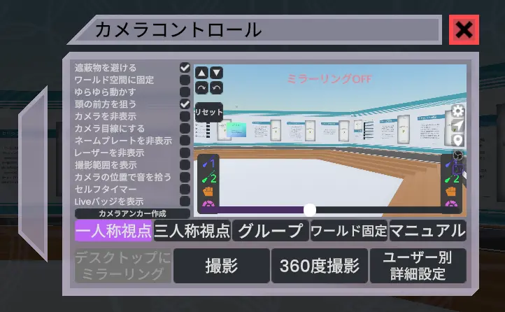
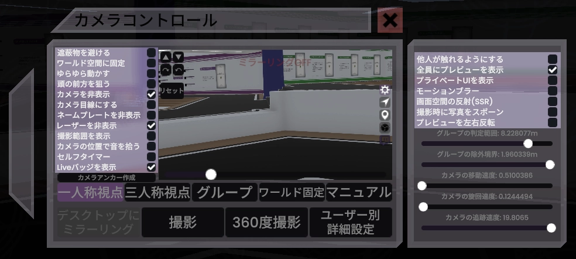

# カメラコントロール
ダッシュメニューのホームタブ左側に「カメラ」を押すと、「カメラ」と「カメラコントロール」パネルが出現します。

カメラコントロールは、カメラの画角や位置取り、その他細かい動きなどを調整するパネルです。他人からは見えません。

**デスクトップモードでは使用できません！**

- あまり見やすくありません。将来的に改善する予定があるようですが、現状はこのような見た目です。
  - <https://github.com/Yellow-Dog-Man/Resonite-Issues/issues/743>
## 撮影方法
### 撮影
- １枚写真を撮ります。
  - 普通の撮影方法です。
### 360度撮影
- 360度写真を撮影します。
  - 撮影したあとの写真が板状ではなく、球体の形をして出てきます。
### デスクトップにミラーリング
- デスクトップのResoniteのウィンドウにカメラの映像を表示します。
  - 普段は自分の視点の映像が表示されます。
  - カメラの映像が映ったウィンドウをOBSなどの録画・配信ソフトでキャプチャして使うことが想定されています。
- これはカメラの説明ではありませんが、Resoniteの画面をクリックしたあと「Alt + Enter」を押すことでフルスクリーンモードにできます。
## カメラの位置取り
| 項目 | 説明                                       |
| --- |------------------------------------------|
|一人称視点| ユーザーの視点の位置にカメラが追従します。                    |
|三人称視点| ユーザーを映すようにカメラが動きます。                      |
|グループ| 三人称視点と似ていますが、近くにいる人が全員映るようにカメラが自動的に動きます。 |
|ワールド固定| カメラの位置だけが固定され、ユーザーの方を向くようになります。          |
|マニュアル| カメラを掴んで動かせるようになります。 写真を撮る時はコレが使いやすいと思います。 |
- 「マニュアル」以外はどちらかと言うと動画向けの設定です。
### 一人称視点
- FPSっぽい、その人視点の映像が撮れます。
### 三人称視点
- デフォルトではあたなの、頭上後方にカメラが配置されます。
  - カメラコントロールのプレビュー画面右上のボタンを押すとカメラの位置が変わります
    - 「▲」「▼」ボタン
      - カメラの高さを調整します。
    - 「↷」「↶」ボタン
      - 自分とカメラの位置関係を調整します。自分を中心にカメラが回転します。
- 映す対象を自分以外にすることができます。
  - 詳しくは「ユーザー別詳細設定」の項目で。
### グループ
- 三人称視点と似ていますが、近くにいる人全員が映るようにカメラの位置を自動的に調整してくれます。
  - プレビュー画面右側の歯車ボタンから、「近くにいる」とみなす距離を調整できます。
### ワールド固定
- カメラが固定され、ユーザーの方を向くようになります。
  - 他の人がカメラを持っていると、その人の方を向くようになります。
### マニュアル
- 手、またはレーザーでカメラを直接動かして画角を調整するモードです。
  - カメラが勝手に動かないモードとも言えます。
- ズーム倍率調整もカメラのレンズっぽいところを直接回すか、カメラの画面から直接調整する必要があります。

## カメラの細かい設定

右側のパネルは、歯車アイコン（プレビュー画面右側に並んだボタンのうち一番上）を押すと出てくるパネルです。
### プレビュー画面左側の項目
| 項目 | 説明                                       |
| --- |------------------------------------------|
|遮蔽物を避ける| カメラが遮蔽物に隠れないように動きます。                    |
|ワールド空間に固定| カメラがワールド空間に固定されます。                    |
|ゆらゆら動かす| カメラがゆらゆら動きます。                    |
|頭の前方を狙う| カメラが自分の頭ではなく、頭の前方を中心に収めるようになります。                    |
|カメラを非表示| カメラがカメラに映らなくなります。  影とかミラーとかにカメラを映さなくする設定はこれ。                    |
|カメラ目線にする| アバターの目線がカメラの方を向くようになります。                   |
|ネームプレートを非表示| ネームプレートがカメラに映らなくなります。                    |
|レーザーを非表示| レーザーがカメラに映らなくなります。                    |
|撮影範囲を表示| カメラが映る範囲が表示されます。                    |
|カメラの位置で音を拾う| 音を拾う位置が視点の位置ではなくカメラの位置になります。 基本的に録画・配信用です。                    |
|セルフタイマー| セルフタイマーモードになります。                    |
|Liveバッヂを表示| 頭上に「●LIVE」を表示されます。「配信・録画中です」と周りに知らせるためのものです                    |
### 右側のパネルのほう
他人が触れるようにする
全員にプレビューを表示
プライベートUIを表示
モーションブラー
画面空間の反射（SSR）
撮影時に写真をスポーン
プレビューを左右反転
| 項目 | 説明                                       |
| --- |------------------------------------------|
|他人が触れるようにする| 他人もカメラに触れるようになります。 カメラコントロールは見えません。                    |
|全員にプレビューを表示| カメラのプレビューを全員に見れるようにします。                    |
|プライベートUIを表示| ダッシュメニューやカメラコントロールなどをカメラに映るようにします。                    |
|モーションブラー| モーションブラーを有効にします。                    |
|画面空間の反射（SSR）| 画面空間の反射（Screen Space Reflection）を有効にします。つるつるした物体に他のものが反射して映りこむようになります。                    |
|撮影時に写真をスポーン| 撮影時に写真をスポーンします。                    |
|プレビューを左右反転| プレビューを左右反転します。                    |