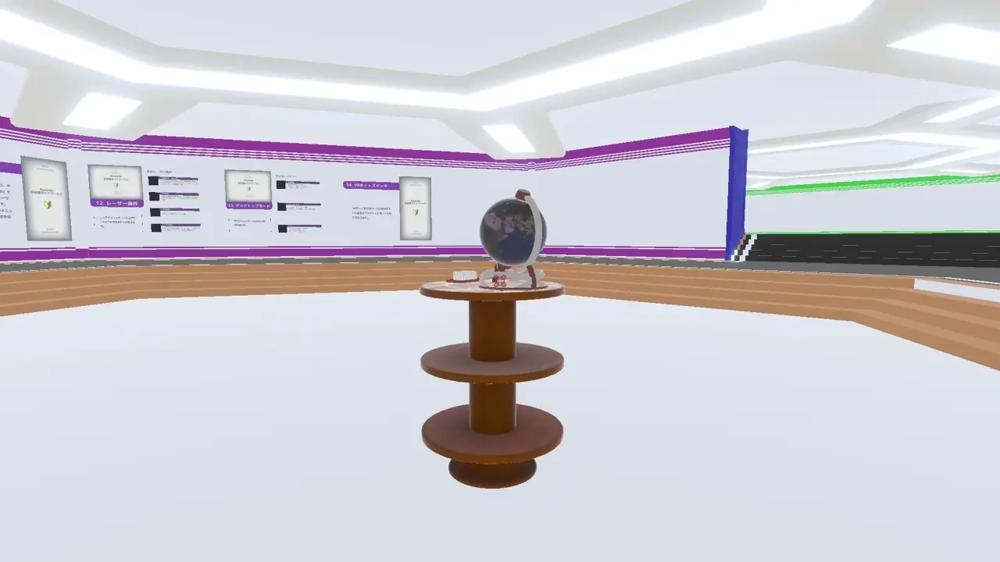

# デスクトップモードでのカメラ

このページだけは、今のところ分量が増える予定がありません。本当に書くことが少ないので……

## カメラ操作
| キー | 機能 |
| --- | --- |
| Shift + P | 写真を撮影する |
| Ctrl + P | セルフタイマーで写真を撮影する |
### 写真の撮影

- Shift + Pで現在の視点の写真を撮影できます。
  - 撮った写真は目の前に出てきます。
### セルフタイマーでの写真撮影

- Ctrl + Pでセルフタイマーを使って写真を撮影できます。
  - 10秒後に写真が撮影されます。
    - セルフタイマーの時間は、設定で変更できます。
      - 設定 > 表示 > スクリーンショット > タイマーの時間(秒)
  - 撮った写真は写真を撮影したところに出てきます。
- セルフタイマーを起動すると、起動した場所にプレビュー画面と、残り時間が表示されます。
  - セルフタイマーを起動した後で移動して、自分も集合写真に写るなどの使い方ができます。
- いまのところ、セルフタイマーを後からキャンセルする機能はありません。