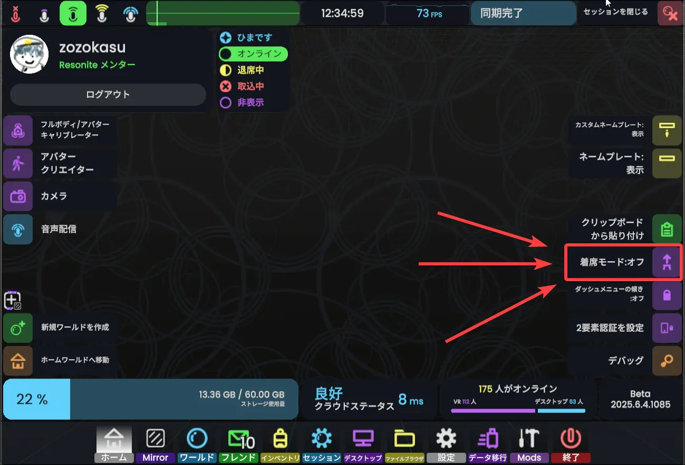
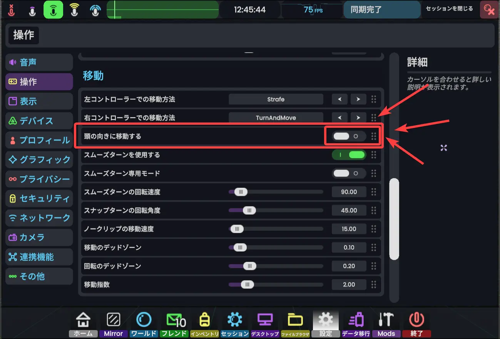
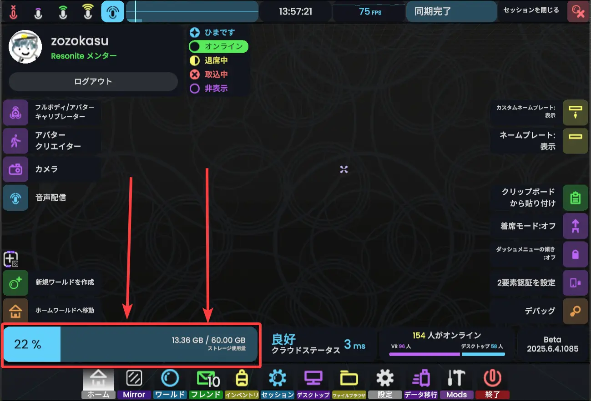
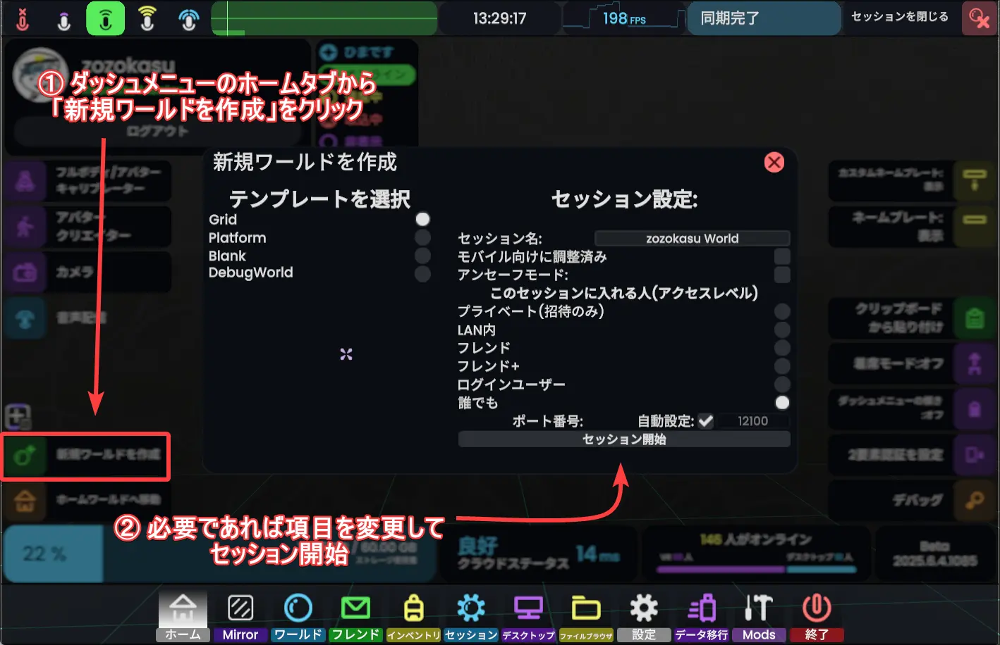
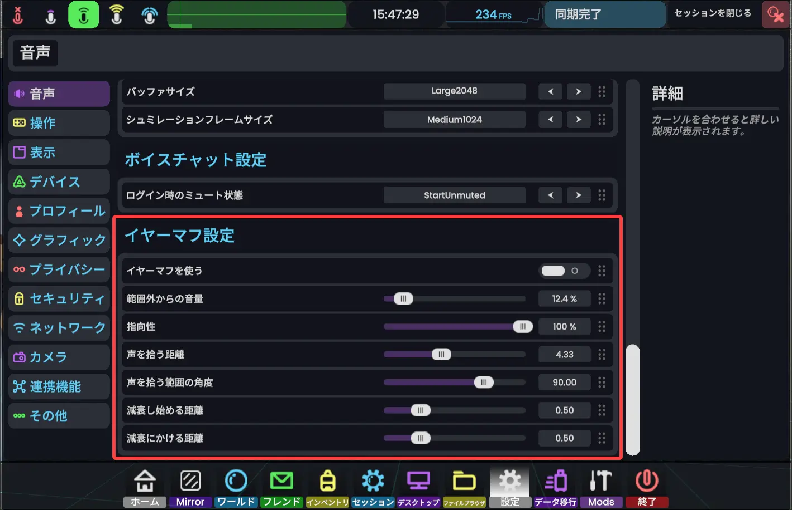

# 一問一答 よくある質問

ここは、Resoniteの日本人初心者からよく聞かれる質問をまとめたページです。

公式wikiの**よくある質問**の参照もおすすめします。<https://wiki.resonite.com/Frequently_Asked_Questions/ja>

## 日本人はどこにどれくらいいますか
だいたい21:00～24:00ごろがピークです。今のところ、24時以降の深夜や昼間のユーザーは少ないです。

ただし、朝6:00と7:00にラジオ体操イベントが開催されており、10～15人前後のユーザーが集まります。
## 着席モードの切り替え
デフォルトでは、ダッシュメニューの「ホーム」タブから切り替えられます。

## 上下に飛ぶ時頭も向けないとならなくて大変・手の方向に移動するようになってしまった
ダッシュメニューから設定を開き、`操作`>`移動`>`頭の向きに移動`のオンオフを切り替えると解決すると思います。

## 歩き方・姿勢が変
残念ながら仕様です。

ただし、アバターの姿勢を計算するシステム（IK）を新しく作りなおす計画はあるようです。この作業を優先してほしいなら、以下のissueにサムズアップのリアクションをつけてください。
- [New in-house full body IK system #612](https://github.com/Yellow-Dog-Man/Resonite-Issues/issues/612)
## 重い！軽くしたい！
- もしかして、ミラーの解像度が高すぎませんか？

ダッシュメニューから設定を開き、`グラフィック`タブの中の設定を変更すると**多少は**軽くなるかもしれません。

特に、`グラフィック` > `テクスチャ品質`の`最大テクスチャサイズ`から**読み込むテクスチャのサイズの上限を設定できる**ほか、`相対的なテクスチャサイズ`から**テクスチャのサイズを一律で半分に減らす**などの設定ができます。

ただし、Resoniteのフレームレート低下の原因は、GPUやグラフィックなどに関連するものよりも、コンポーネントやスクリプトの処理などのゲームエンジンそもそものパフォーマンスの悪さに起因するものが大きく、ユーザーの設定ではどうしようもない場合がほとんどです。
> [!tip] パフォーマンス改善のアップデートについて
> Resoniteが他のゲーム・VRプラットフォームと比べてパフォーマンスが非常に低い問題はほとんど全てのユーザーや運営にも認知されており、[2024年に行われたユーザーへのアンケートの結果](https://wiki.resonite.com/May_2024_survey)と[運営チーム内での意思決定](https://github.com/Yellow-Dog-Man/Resonite-Issues/blob/main/HOW_WE_PRIORITIZE.md)に基づいて、Resoniteの運営は現在[パフォーマンス改善に取り組んでいます](https://github.com/orgs/Yellow-Dog-Man/projects/29)。
> 
> 詳しい内容はこちらをご覧ください (<https://github.com/orgs/Yellow-Dog-Man/projects/29/views/1>)

## アバターの変え方・アップロード方法
詳しくは
- [自動でアバターを着るようにする](../avatar/favoriteAvatar.md)
- [アバターアップロード](../customize/avatarUpload.md)

をご覧ください。
## アバターの容量制限・アバターランク的なものはありますか
### アバターの容量制限
**アバター一体あたりの容量制限はなく**、アバターの**アップロード数の制限もありません**。

その代わりに、**インベントリ全体の容量に制限があります**。デフォルトのストレージ容量は**1GB**です。

*支援（課金）をすると増やせます。[詳細](https://wiki.resonite.com/Supporting_Resonite)*

> [!note] 1㎇（デフォルト、無課金）で保存できるアバターの数
> Resoniteでは、「そのアバターが占めるストレージ容量」の計算が難しいです。 実は、Resoniteではアバターデータをまるごとではなく、メッシュ（ポリゴン）やテクスチャ単位でバラバラにしてアップロードしています。アップロードしたアバターが使用するものと完全に一致するメッシュやテクスチャがインベントリに既にあった場合、そのアセットデータを使い回してインベントリ使用量を節約してくれます。例えばアバターの衣装を着せ替えて保存した場合、アップロードされるのは衣装のアセットとヒエラルキーデータ（どのアセットを使うか、どんなボーン構造か、などが書かれたデータ）だけになります。
>  また、メッシュやテクスチャも自動的に圧縮してアップロードされます。
> 
> ですので、答えとしては
> - 使われた**各種アセットを重複なしで数えた時のデータ量の合計が1GBを超えない限り**（VRChat等でよく目にするようなアバターは数十～数100MBくらい。多くて10種類くらいが限度？）
> - ただし、マテリアルの数値を含む**パラメータを調整しただけの差分はたくさん保存できる**
> 
> になります

### アバターランク
ありません。異常に重たいなと感じたら、その人のアバターを非表示できます。また、設定から[読み込みテクスチャサイズを小さくすることができます](#重い軽くしたい)。

## ユーザーランク的なものはありますか
ユーザーの格付けとしての「ユーザーランク」のような制度は、**今のところ存在しません**。

ただし、ネームプレート上部にあるバッヂからどんな人かをおおよそ推測することができ、中には公式に認証された特定の役職を示すバッヂがあります。
 詳しくはこちら: <https://wiki.resonite.com/Badges/ja>
### 信頼性のあるバッヂ・役職
以下のバッヂはそのユーザーが特定の役職をもつことを表すもので、カスタムネームプレート等による偽装がガイドラインで禁止されています。

メンターとモデレーターは、厳密には運営チームに所属しません。少し独立した組織に属するボランティアです。
#### モデレータ

青い盾のバッヂがついているユーザーは **モデレーター** です。いまのところ日本人のモデレータは二人います。

迷惑行為を繰り返すようなアカウントに対して一定の制裁を科す権限を持っています。（永久BANは運営チームのみが行えます）

詳しくは[こちら](https://wiki.resonite.com/Moderation#Moderators)

#### メンター

緑色の電球のバッヂがついているユーザは**メンター**です。
 メンターは、初心者を中心とするResoniteのあらゆるユーザーへのヘルプを行うボランティア、あるいはその活動の名称です。

「運営チームが監督するメンタープログラムに認定された、初心者案内人」だと考えて差し支えありません。困ったことがあればメンターに声をかけてください。
 メンターは、右のようなバッヂがついているほか、ネームプレートが緑色になっています。

詳しくは[こちら](https://wiki.resonite.com/Mentors/ja)

## セッション（インスタンス）の建て方
ワールドを開く、または新しくワールドを作る方法の２つがあります。
### ワールドを開く
[こちら](../worlds/openWorld.md)をご覧ください。
### 空のワールドを作成する
1. ダッシュメニューのホームを開く
2. 右下の「新規ワールドを作成」ボタンを押す
3. 必要であれば設定を変更して「セッション開始」

 新しくワールドを作りたい時や、とりあえず空っぽのワールドを作りたい時は新規ワールド作成が便利です。
## セッション設定の変更方法
セッションホストやセッション内でAdmin権限を持つユーザーは、セッションを建てた後
- セッション名
- 公開範囲
- セッション最大人数

などを後から変更することができます。

詳しくは[セッションの細かい設定](../session/manageSession.md)をご覧ください。

## ワールドオーブ・セッションオーブの使い方

ワールド（セッション）一覧の詳細画面から、「ワールドオーブ（セッションオーブ）を取得」ボタンを押すと、目の前にオーブが出現します。
## ワールドのお気に入り登録
現在、ワールドをお気に入り登録する機能はありません。

お気に入り機能の代わりとして**ワールドオーブをインベントリに保存する**という方法が使えます。

## ペン・ミラーがあるワールドがない
Resoniteでは、インベントリからミラーやペンを取り出せるため、ミラーやペンが置かれているワールドはそこまで多くありません。（ミラーは結構置かれているかも）

インベントリ内のResoniteEssentials（最初からあります）の中にミラーやペンが入っています。
### ミラー

`Resonite Essentials` の中にあります。丸っぽいアイコンが目印です。

ホームワールドに置かれているミラーと同じものです。

### ペン

`Resonite Essentials` > `Tools` > `Brushes` > `Geometry Line Brushes` の中に入っています。

お絵かき用のペンも多いですが、左上から順番に数えたとき割と右の方にある緑色のにょろにょろとしたアイコンのペン（`Geometry Line Brush (Unlie Green)`）が筆談に向いているペンです。

デフォルトでは緑色ですが、ペン装備中の**コンテキストメニューから「色を変更」を選択**することで、**ペン色設定パネルを出す**ことができます。

また、ペンの太さを変えられる機能があるほか、書いたものをインベントリに保存することができます。
 書いたものを保存する際は、`Resonite Essentials` > `Tools` > `GlueTool`（紫系ツールの左端）を使って書いたものを一個にまとめてから保存しましょう。
> [!question] ミラー？ペン？（初心者・文脈がよくわからない人向け）
> ResoniteやVRChatなどのVRSNSでは、ミラー（鏡）の前に陣取って自分と他ユーザーお互いのこだわりアバターを眺めながら雑談したり、放置しているユーザーに対して手書きメッセージを残しておく遊び方・慣習があります。
## ホームワールドの変え方
アバターのお気に入り登録と同じように、ワールド（ワールドオーブ）を選択することでホームワールドに設定することができます。

1. ワールドオーブをインベントリに保存
2. 保存したワールドオーブを選択
3. インベントリ上部の「ホームに設定」ボタンを押す

## フレンドの送り方
詳しくは[フレンドになる](../contacts/addContact.md)をご覧ください。
## フレンドと非フレンドの区別
目の前にいる人がフレンドかそうでないか？フレンドじゃない人はだれか？の区別はいくつか方法があります。

ダッシュメニューの「ホーム」タブ内にあるネームプレート設定を切り替えると、フレンドでない人を表示するようにできます。

また、ワールドタブから開けるセッションの詳細画面のユーザーリストは、フレンドは緑色、フレンドでない人は白文字で表示されます。
## アバターをアップロードしたい
[アバターアップロード](../customize/avatarUpload.md)をご覧ください。

## VRChatとの互換性・VRChatからのアバターの持ち込み
VRChatのコンテンツをResoniteにそのまま持ってくることはできません。VRChatはUnityをもとに作られていますが、ResoniteはFrooxEngineという名前の独自開発されたゲームエンジンで動作しているためです。
 そっくりそのまま持ってくることはできませんが、オブジェクトとコンポーネントがあるという点ではいくつか共通しているため、ある程度手作業で再現することはできます。

また、現在のresoniteではカスタムシェーダーが利用できないため、liltoonをはじめとするユーザー製のシェーダーが利用できません。

### Modular Avatar for Resonite
[Modular Avatar - Resonite対応](https://modular-avatar.nadena.dev/dev/ja/docs/experimental-features/resonite-support)

Modular Avatar を利用してセットアップされたVRChatアバターをResonite用データとしてエクスポートするアドオンが開発されています。
 Resoniteではカスタムシェーダーが使えないないので多少見た目は異なりますが、改変したアバターをある程度楽にResoniteに持ってくることができます。

## liltoon使えますか（結論から言うと現状使えません）
Resoniteでは現在、カスタムシェーダーがサポートされていません（[将来的に実装する計画](https://github.com/Yellow-Dog-Man/Resonite-Issues/issues/632)はあるようですが）。
 最初から入っているマテリアルにテクスチャを割り当てたり、マテリアルのパラメータをスクリプトで制御するなどして見た目をいじることができます。

ビルトインのトゥーンシェーダーとして、現在XiexeToonのみが使えます。

## 日本語入力したい
VR用のキーボードをユーザーが作成したものに変更することができます。
## 保存しちゃいけないアイテムってありますか
基本的に、**保存できるアイテムは保存してもよい**、という慣例があります。

ライセンスなどの都合により保存されたくないアイテム（たとえばアバター）は、**そもそも保存されないようになっている**ためです。
 Resoniteにはコンテンツを保護する機能があるため、保護するかしないかは制作者の自由（責任）になります。

もし、コンテンツの保護機能を迂回できてしまったら悪用せず[セキュリティチケット](https://support.resonite.com/)を発行して運営チームに詳細を報告しましょう。

## インベントリに保存できない！
アイテムは、インベントリ上で今開いているフォルダに保存されます。
 保存できない場合は保存権限のない**他人のフォルダを開いているかも**しれません。

また、Resoniteを起動してから一度インベントリを開かないと保存できないバグがあります。

詳しくは[アイテムを保存する>保存できないときは](../inventory/saveItems.md#保存できない時は)をご覧ください。

## インベントリを整理したい
アイテムやフォルダを移動する機能は現在実装されていません！

1. アイテムを取り出す
2. 移動したい場所にアイテムを保存する
3. もとあったアイテムを削除する

といった手順を踏む必要があります。

> [!NOTE] 関連するissue
> <https://github.com/Yellow-Dog-Man/Resonite-Issues/issues/1119>
>  将来的なインベントリ画面のリワークの計画があります。アイテムやフォルダの移動や検索機能の実装が予定されています。
## 写真の保存はどっちを押せばいいんですか
### 「スクリーンショットを保存」を押してください
## 音声やアバターのカリング

### アバターカリング（設定としてはありません）
アバターのカリングは、Resoniteでは**現在サポートされていません**。
 ワールドに設置するギミックとして、ユーザーが独自に作ったものは存在します。

### イヤーマフモード
設定の`音声` > `イヤーマフ設定`からイヤーマフモードをオンにすることができます。

イヤーマフモードは、自分の視界の外から聞こえる音を小さくする機能です。
 範囲の広さや、どの程度小さくするかなどを細かく設定できます。

## Mac・Linux対応
Macは現在対応していません。

Linuxも、2025年の3月にLinux版グラフィッククライアントの配布・対応が停止されました。当面はProton等の仮想マシン上で動作して、ということになっています。
> [!NOTE] 関連するissue
> MacOS対応: [MacOS compatibility  #1412](https://github.com/Yellow-Dog-Man/Resonite-Issues/issues/1412)
>  Linuxクライアントの廃止（再開の予定に関するコメント）: [Linux Steam branch deprecation #3808](https://github.com/Yellow-Dog-Man/Resonite-Issues/discussions/3808)
## スマホ・Quest対応
スマホやMeta Questは現在対応していません。
 将来的に対応する計画はあるようですが、いつになるかは不明です。

> [!NOTE] 関連するissue
> [Standalone Support/Quest Support #5](https://github.com/Yellow-Dog-Man/Resonite-Issues/issues/5)
## 「スキン」はどこで手に入りますか
ResoniteやVRChatなどのVRSNSではユーザーの見た目を、一般に**アバター**と呼びます。

アバターは無料で配布されているものや、booth等で販売されているものがあります。

初心者向けワールドの「JPチュートリアルワールド Resonite」で、いくつかのアバターが無料配布されています。

## トラッカーの利用・フルトラ
トラッカーを利用したアバターの全身トラッキングや、身体以外にとりつけたトラッカーの追跡に対応しています。

公式のwikiに記事があります。: [Full Body Tracking](https://wiki.resonite.com/Full_Body_Tracking)
## アイコンの設定
フレンドリストや一部のワールドやアイテムなどに表示できるアイコンを設定できます。

アイコン設定手順に、言葉ではとても説明しづらいResonite特有のフィジカルな操作が登場するため、操作方法は以下の動画を見てください。

https://www.youtube.com/watch?v=9DVTYrdFZXs
## マイクミュート・音量調整

ダッシュメニュー左上に並んだマイクボタンのうち、**最も左側のボタン**（右の画像）を押すとミュートの切り替えができます。
 デスクトップモードの場合はMキーを押すことでもミュートの切り替えができます。

[//]: # (公式にサポートされている機能は以上のみですが、ユーザーの作ったツールをアバターに導入することで機能を増やせます。)

[//]: # ()
[//]: # (### コントローラのボタンで切り替えたい)

[//]: # (### ミュート状態を視界に表示したい)

[//]: # (## フェイスミラー)
## 荒らしの対処（キック・BAN）

セッション内でModerator以上の権限（Moderator・Builder・Admin）を持つユーザーは、セッションにいるユーザーを**投票なしに即座にキック（追放）できます**。
 詳しくは[ユーザーの管理方法](../session/userControl.md)をご覧ください。

## どんなコミュニティ・イベントがありますか
たくさんあります！……が、あんまり特定のコミュニティやイベントを取り上げることは避けます。

[XでResoniteと検索](https://x.com/search?q=%23resonite&src=typed_query)したりするとresoniteユーザーのポストが見つかるほか、[resoniteの日本語ユーザーを中心とするmisskeyインスタンス](https://misskey.resonite.love/)もあります。

いくつか公共性の高いdiscordサーバーがあります。
#### Resonite 公式Discordサーバー
<https://discord.gg/resonite>

Resoniteの公式Discordです。ほとんど英語です。
 運営のお知らせや、アップデート情報、開発ログなどがあるほか、雑談チャンネルや質問フォーラムがあります。運営の人が結構質問に答えてくれます。

#### Resonite Japan Discord
<https://discord.gg/resonite-japan>

日本語コミュニティが中心のDiscordサーバーです。雑談チャンネルのほか、ユーザーによるイベント告知チャンネルもあります。

## おすすめワールドはありますか
日本語対応しているおすすめワールドをいくつか紹介します。

### チュートリアル系
#### JPチュートリアルワールド Resonite
<https://go.resonite.com/record/G-Neos-East-Japan/R-95d04d7b-322f-47ea-a18e-0fc1f473d41e>

**一番最初にいくワールドとしておすすめ！**
 日本人向けのチュートリアルワールドです。Resoniteの基本的な操作方法を学ぶことができます。
 無料のアバターがここでいくつか配布されているほか、おすすめワールドへのオーブがおいてあります。
#### れぞプラザ | Resonite 日本語ガイド
<https://go.resonite.com/record/U-Zozokasu/R-23fea1f8-74fb-4d43-9bd0-fb7b2b20eeeb>
 このサイトと同じような内容が書かれたチュートリアルワールドです。比較的文章が多いです。
### おもしろギミックワールド
#### Figure Generator - フィギュア製作機
<https://go.resonite.com/record/U-orange/R-83d9b268-e7ef-45f6-b29e-ed5ba8a269b9>
 自分のアバターのフィギュアを作ることができます。インベントリに保存することもできます。
#### [ESD] Neural Network with ProtoFlux
<https://go.resonite.com/record/G-Shared-Project-rheni/R-af60ca03-34fc-48c0-9570-748192201b3f>
 ニューラルネットワークの仕組みが学べるワールドです。かなり見た目も凝っているすごいワールドです。日本人ユーザーが作ったワールドです。

## 課金・支援など
Resoniteの開発を支援したり、発展に寄与する方法はいくつかあります。
- コンテンツをつくって公開する
- ボランティア活動
   - wikiやresonite本体の翻訳
   - メンターになる
   - バグ報告
   - など
- 課金（支援）

詳しくは
- <https://wiki.resonite.com/Supporting_Resonite>
- <https://wiki.resonite.com/How_to_Help>
### Resoniteにおける課金
Resoniteのサポーターになると、支援額に応じて
- サポーターバッヂの付与
- **ストレージ容量の増加**
- ヘッドレスの利用やカスタムバッヂ（毎月10$以上）
- グループの作成（20$以上）

などの特典があります。
 支援はResoniteのwebサイト上からから行うことができます。
 - <https://account.resonite.com/>

詳しい手順はwikiのページを参照してください。
 - <https://wiki.resonite.com/Supporting_Resonite/Subscription>

## ユーザー名変更
ユーザー名の変更はフレンドリストの「Resonite」に以下のコマンドをDMとして送信することで行うことができます。

`/changeUsername <現在のユーザー名> <新しいユーザー名>`

名前を変更してから再び名前を変更できるようになるまで、**7日間待たなければなりません**。

詳細はこちら: <https://wiki.resonite.com/Resonite_Bot#User_Commands>
## メールアドレス変更
アカウントで使用するメールアドレスの変更はフレンドリストの「Resonite」に以下のコマンドをDMとして送信することで行うことができます。

`/setPrimaryEmail <メールアドレス>`

詳細はこちら: <https://wiki.resonite.com/Resonite_Bot#User_Commands>
## Unityとの互換性
ほとんどありません。アニメーションが入ったfbxファイルをインポートすることができたりしますが、それ以外は互換性がありません（再現はできるかもしれません）。
### 技術的な話
> Resoniteではゲーム内でシーンインスペクターを開くことができ、ワールド内のオブジェクトや、その位置や姿勢などのパラメータ、それに付随するコンポーネントを編集できたりします。

こういう話はどこかで聞いたり、見たことがあるかもしれません。**ですが！**

 Resoniteのインスペクターから確認できる**オブジェクトやコンポーネントはUnityのものではありません！** すべてResoniteが独自に実装した仮想的なオブジェクト、コンポーネントです。
 Resoniteでは確かにUnityが使われてはいますが、もはや単なるレンダラとして使われているだけであり、Resoniteのゲームエンジンの機能は独自につくったもの（FrooxEngine）によって動いています。

詳しくはこちら
- <https://wiki.resonite.com/FrooxEngine>
- <https://wiki.resonite.com/Architecture_Overview>

## コンテンツの作り方
Resoniteのコンテンツ制作の手順は大まかに
1. ゲーム内または外部ソフトでアセットを制作（Blenderで3Dモデルをつくったり、Cubaseで曲を作ったり、AIに丸投げしたり）
2. ゲーム内にアセットをインポート（ドラッグアンドドロップでできます）
3. **頑張ってロジックを組む**
4. ワールドを公開したり、パブリックフォルダに保存したりする

と表せます。

 コンポーネントやスクリプトを組みあわせて様々なギミックを作ることになるため、恐らくUnityやUnrealEngineと若干似たような部分があるかもしれません。
 ただし、Resoniteではあらゆるギミックの実装をアプリ内で行うため、resonite特有のエディターツールについて最低限学ぶ必要があります。
 Resoniteでのギミック制作に関するサイト[（ぞかすのResonite開発メモ）](https://resonite-creation-guide.zozoka.su/)を作ったので、こちらを参考にしてください。

[//]: # (## そもそもの遊び方)

[//]: # (## ログインの記憶)
## NeosVRとの関係
とある出来事がきっかけでNeosVRの開発チームが独立することになり、その結果できあがったものがResoniteです。
 ResoniteはNeosVRからデータ（インベントリやワールド）の引っ越しができたため、ResoniteにはNeosVR時代に作られた妙に公開日が古いワールドが存在します。