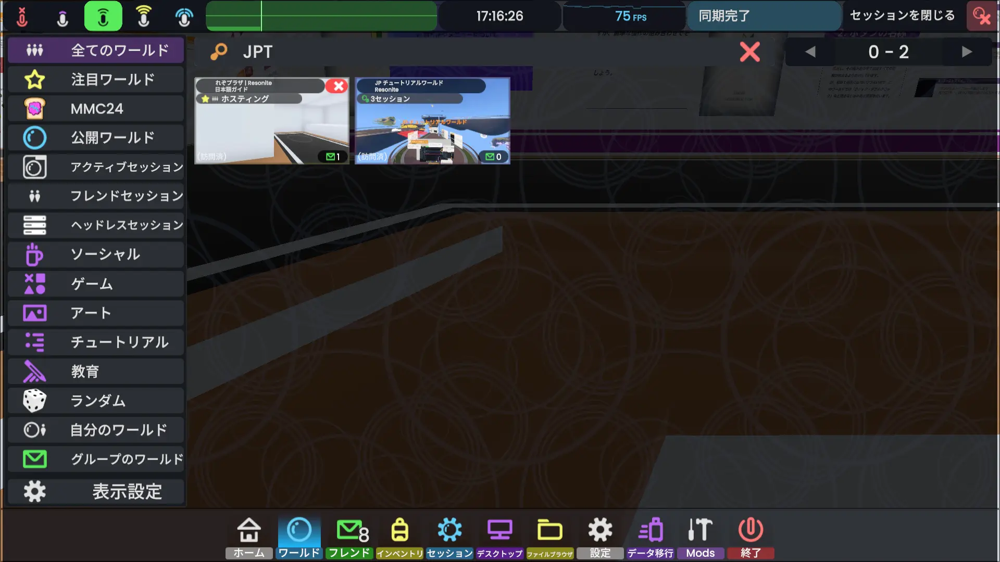
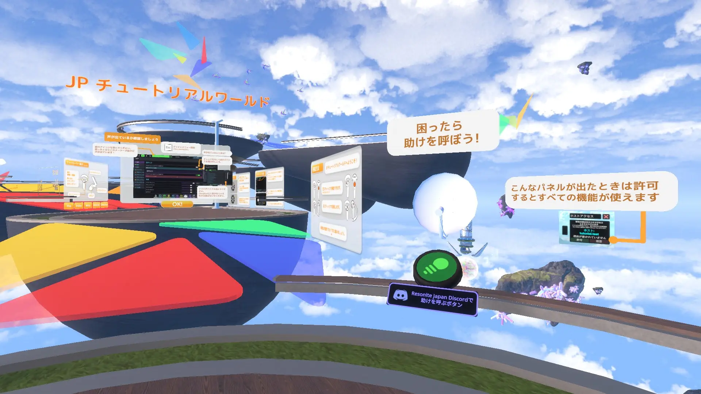
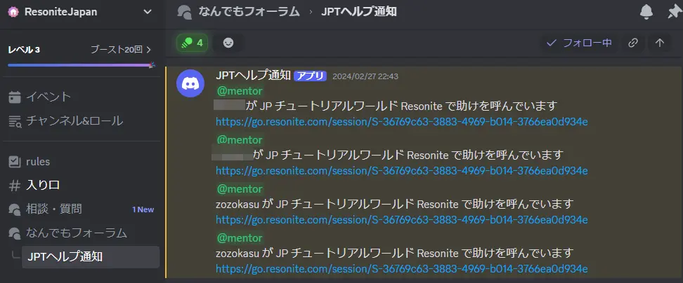
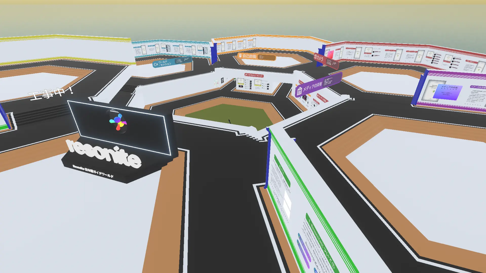

# 日本人を探す
## Resoniteの中

毎日朝6時と7時にラジオ体操をやってる人たちがいるほか、夜20時ごろから日本人ユーザーのオンライン人口が増えて、24時頃にピークを迎えます。

深夜や特に平日の昼間に日本人はほとんどいません（2024年10月時点では）。

ダッシュメニュー、ワールドタブ内から「アクティブセッション」を選択すると日本人がいるセッションを見つけられるかもしれません。

### 各種チュートリアルワールド
ワールド検索画面で「JPT」と入力するとチュートリアルワールドが出てきます。

*日本語ガイドワールドと、JPチュートリアルワールド。いずれも有志が作った非公式のワールド。*

#### JPチュートリアルワールド

Resonite最初期からある日本語チュートリアルワールド。初心者におすすめです。

Resoniteの一通りの操作方法が学べます。

「困ったら助けを呼ぼう！」と書かれたボタン（画像中央）を押すと、[ResoniteJapanDiscord](findJapanese.md#resoniteの外)に通知が飛びます。

*連打するとめちゃくちゃ通知が飛びます*

#### 日本語ガイドワールド

初心者・一人で遊びに来た人向けのResoniteチュートリアルワールドです。このサイトのワールド版です。

上のJPチュートリアルワールドが体験を重視しているものだとすれば、こちらは説明を重視しています。**チュートリアルというよりむしろ「説明書」に近いワールド**になっています。

- 先に「JPチュートリアルワールド」で操作を一通り覚えてから、「日本語ガイドワールド」で説明を読むと理解が深まるかもしれません。
### その他
- [**「日本人のよくいるワールド」**](./forOtherPlatformUser.md#日本人がよくいるワールド)を参照してください。

## Resoniteの外
### Resonite Japan Discord
Resonite日本語コミュニティDiscord、「[ResoniteJapan](https://discord.gg/resonite-japan)（招待リンク）」があります。日本人コミュニティで最大のDiscordサーバーです。

用途として
- 質問・雑談
- イベント告知
- 制作物紹介
- 制作相談

などに使われています。