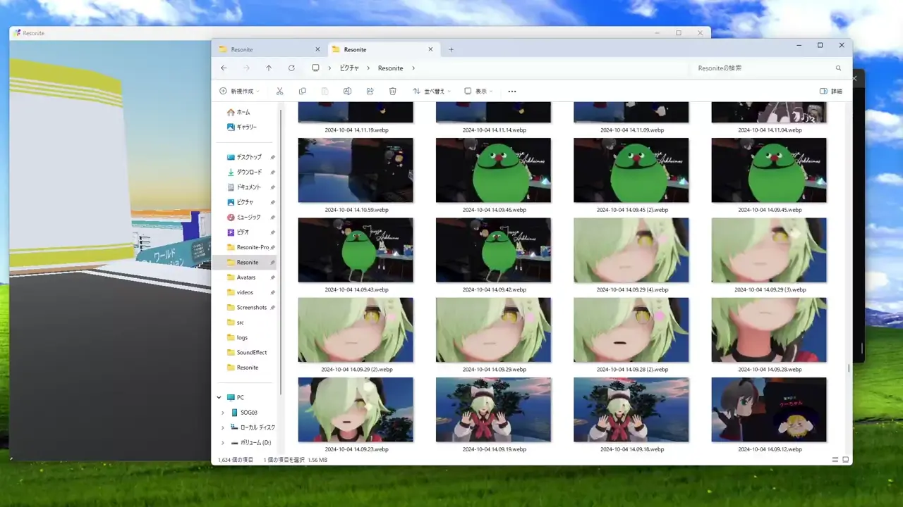

# ファイルをインポートする
このページでは、ファイルをインポートする方法について説明します。

## ファイルのインポート方法

*ドラッグアンドドロップで画像をインポートする様子。3Dモデル等も同じ方法でインポートできる。*

1. ファイルを読み込みます
   - ファイルの読み込み方法はいくつか方法があります。
      - ファイルをResoniteのウィンドウ上にドラッグアンドドロップ
      - URLをコピーして、Resoniteのウィンドウ上でペースト
        - `Ctrl + V` または、ダッシュメニューの「ホーム」タブの「クリップボードから貼り付け」をクリック
      - ダッシュメニューの「ファイルブラウザ」タブから読み込みたいファイルを選択してダブルクリック
2. 「○○インポーター」が表示されるので、インポートしたいものに応じて選択。
   - ほとんどの場合一番上のボタンを選択し続ければ大丈夫です。
   - zipファイルなどのメディアではない一般的なファイルはそのままファイルとして出現します。