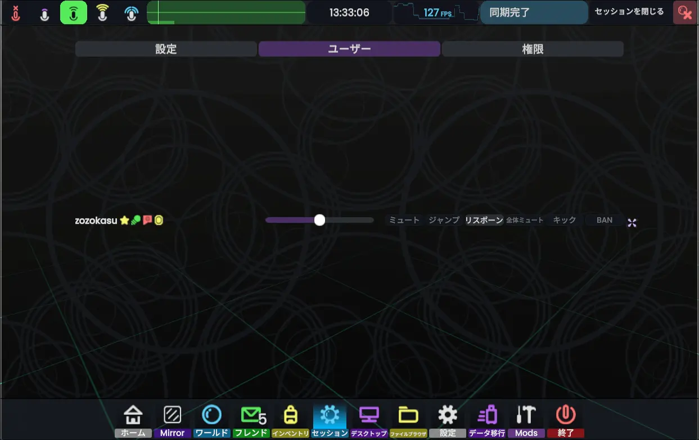

# ユーザーの管理方法
ダッシュメニュー「セッション」ページ、「ユーザー」タブから、セッション内にいる各ユーザーに対してアクションを実行できます。

|アクション名| かんたんな説明              |
|---|----------------------|
|ミュート| ユーザーの音声をミュートします。     |
|ジャンプ| そのユーザーの目の前にテレポートします。 |
|リスポーン| ユーザーをリスポーンさせます。      |
|全体ミュート| ユーザーの音声を全体ミュートします。   |
|キック| ユーザーをセッションからキックします。  |
|BAN| ユーザーをセッションからBANします。  |

## 詳しい説明
### ミュート
- ユーザーの音声をミュート（音量を０に）します。
- 自分だけそのユーザーの声が聞こえなくなります。
  - 他の人にはそのユーザーの声が聞こえます。
### ジャンプ
- そのユーザーの目の前にテレポートします。